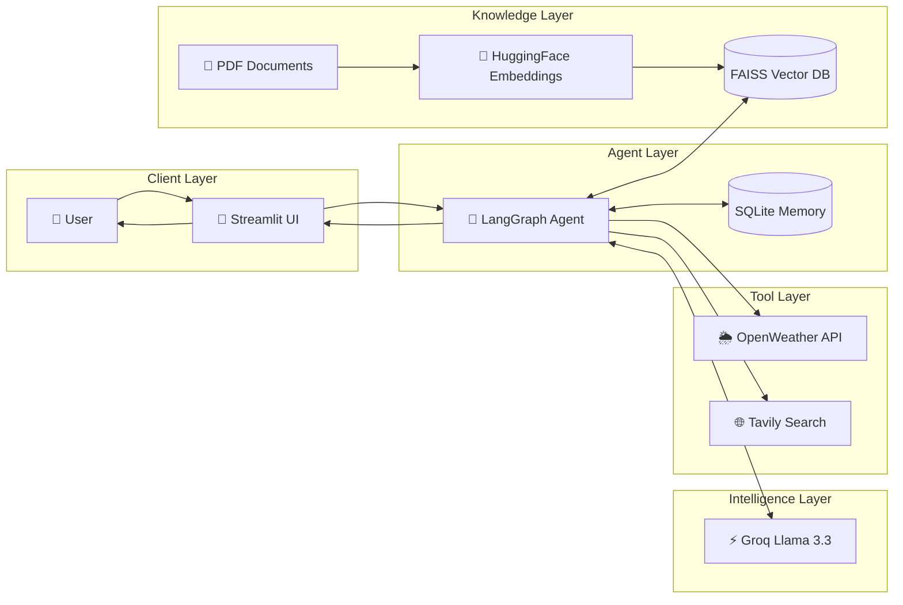

# 🎙️ Voice-Powered Agentic AI Assistant with RAG & Tool Calling

> An advanced AI Assistant built using LangGraph, LangChain, Groq LLMs, Retrieval-Augmented Generation (RAG), Voice Input, and Real-Time Tool Calling.


---

## 🚀 Project Overview

This project is an **Agentic AI Assistant** capable of:

- 🎤 Voice-based interactions
- 🧠 Multi-step reasoning using LangGraph
- 🔍 Retrieval-Augmented Generation (RAG)
- 📄 PDF document understanding
- 🌦️ Real-time Weather Tool Calling
- 🌐 Web Search using Tavily
- 💬 Conversational Memory
- 🗂️ Multi-Chat Session Management
- 🔊 Voice-to-Text Processing
- ⚡ Ultra-fast responses using Groq LLMs

Unlike traditional chatbots, this system can dynamically decide whether to:

- Answer from its own knowledge
- Retrieve information from uploaded documents
- Use external tools
- Search the internet
- Perform reasoning workflows

---

# ✨ Features

### 🤖 Agentic AI Workflow

Built using **LangGraph State Machines** to create intelligent agent behavior.

The assistant can:

✔ Understand user intent  
✔ Decide which tool to use  
✔ Retrieve external knowledge  
✔ Generate contextual responses  
✔ Maintain conversation history

---

### 📄 Retrieval-Augmented Generation (RAG)

Upload PDFs and ask questions about them.

Implemented using:

- PyPDFLoader
- Text Chunking
- HuggingFace Embeddings
- FAISS Vector Database

Benefits:

- Reduces hallucinations
- Provides document-grounded responses
- Enables enterprise knowledge retrieval

---

### 🌐 Tool Calling

The assistant can dynamically invoke external tools:

#### Weather Tool

Provides:

- Current Temperature
- Humidity
- Wind Speed
- Weather Conditions

#### Web Search Tool

Powered by Tavily Search.

Used when:

- Information is recent
- Knowledge is not available locally
- User requests latest updates

---

### 🎤 Voice Assistant

Users can interact through voice.

Pipeline:

Voice Input
↓
Speech Recognition
↓
Text Query
↓
LangGraph Agent
↓
Response

---

### 💾 Persistent Chat History

Supports:

- Multiple conversations
- Session switching
- Conversation storage
- Context-aware responses

---

## 🏗️ High-Level Architecture


# 🛠️ Tech Stack

## Frontend

- Streamlit

## Agent Framework

- LangGraph
- LangChain

## LLM

- Groq
- Llama Models

## RAG

- FAISS
- HuggingFace Embeddings
- PyPDFLoader

## Tools

- Tavily Search API
- OpenWeather API

## Deployment

- Docker
- AWS EC2
- GitHub Actions CI/CD

---

# ⚙️ Workflow

### User Query

```text
User → LangGraph Agent
```

### Decision Making

```text
Need Tool?
    ├── Weather Tool
    ├── Web Search
    └── RAG Retrieval
```

### Response Generation

```text
Tool Output
      +
LLM Reasoning
      ↓
Final Answer
```

---

# 📂 Project Structure

```text
.
├── app_rag.py
├── agentic_chatbot_rag_backend.py
├── requirements.txt
├── Dockerfile
├── .github/
│   └── workflows/
│       └── cicd.yml
├── uploads/
├── data/
└── README.md
```

---

# 🔑 Environment Variables

Create a `.env` file:

```env
GROQ_API_KEY=your_key
TAVILY_API_KEY=your_key
OPENWEATHER_API_KEY=your_key
```

---

# 🚀 Installation

### Clone Repository

```bash
git clone https://github.com/codesnippet12/Voice-Powered-Agentic-Assistant-with-RAG-Tool-Calling.git

cd Voice-Powered-Agentic-Assistant-with-RAG-Tool-Calling
```

### Create Virtual Environment

```bash
python -m venv .venv
```

### Activate

```bash
source .venv/bin/activate
```

Windows:

```bash
.venv\Scripts\activate
```

### Install Dependencies

```bash
pip install -r requirements.txt
```

### Run Application

```bash
streamlit run app_rag.py
```

---

# 🐳 Docker Deployment

Build Image:

```bash
docker build -t agentic-ai .
```

Run Container:

```bash
docker run -p 8501:8501 agentic-ai
```

---

# 🔄 CI/CD Pipeline

Implemented using GitHub Actions.

Workflow:

```text
Push to GitHub
       ↓
Build Docker Image
       ↓
Push to Docker Hub
       ↓
Deploy to AWS EC2
       ↓
Health Check
```

---

# 🧠 Challenges & Key Learnings

Building this project involved solving several real-world engineering challenges beyond simply integrating an LLM.

---

## 1️⃣ Designing an Agentic Workflow with LangGraph

### Challenge

Traditional chatbot implementations follow a simple:

```text
User → LLM → Response
```

However, an intelligent assistant must dynamically decide:

- When to answer directly
- When to search the web
- When to query uploaded documents
- When to invoke external tools

### Learning

Implemented a graph-based workflow using LangGraph where the assistant:

- Maintains state across interactions
- Routes requests to appropriate tools
- Supports multi-step reasoning
- Creates a more production-ready agent architecture

---

## 2️⃣ Building Retrieval-Augmented Generation (RAG)

### Challenge

Large Language Models may hallucinate when answering domain-specific questions.

### Learning

Built a RAG pipeline using:

- PyPDFLoader
- Recursive Text Splitting
- HuggingFace Embeddings
- FAISS Vector Database

This improved answer quality by grounding responses in user-provided documents.

---

## 3️⃣ Tool Calling & Function Routing

### Challenge

The assistant needed access to real-time information unavailable in the model's training data.

### Learning

Integrated external tools including:

- Weather API
- Tavily Web Search

The assistant autonomously decides when tool usage is required and incorporates tool outputs into the final response.

---

## 4️⃣ Managing Conversation State

### Challenge

Maintaining context across multiple conversations while supporting chat switching.

### Learning

Implemented persistent conversation storage using:

- LangGraph Checkpointing
- SQLite Memory Storage

This enabled:

- Multi-session chat history
- Context-aware conversations
- Thread-based conversation management

---

## 5️⃣ Voice-Based Interaction

### Challenge

Creating a natural voice-first experience within a web application.

### Learning

Integrated:

- Speech-to-Text processing
- Microphone input support
- Real-time transcription workflow

This transformed the assistant from a text chatbot into an interactive voice-enabled AI system.

---

## 6️⃣ Dockerization & Cloud Deployment

### Challenge

Deploying AI applications is significantly different from running them locally.

Issues encountered included:

- Missing dependencies
- Docker build failures
- Environment variable management
- Memory limitations
- Cloud networking and security rules

### Learning

Gained practical experience with:

- Docker Containers
- AWS EC2 Deployment
- GitHub Actions CI/CD
- Cloud Networking
- Linux-based deployments

---

## 7️⃣ Debugging Real-World AI Systems

### Challenge

AI applications often fail due to dependency conflicts, API integrations, memory constraints, and deployment environment differences.

### Learning

Developed experience in:

- Reading production logs
- Troubleshooting containerized applications
- Dependency management
- Performance optimization
- End-to-end system debugging

---

# 📚 Overall Takeaways

This project provided hands-on experience across multiple domains:

### Artificial Intelligence

- Agentic AI Systems
- RAG Architectures
- Tool Calling
- Prompt Engineering

### Backend Engineering

- API Integration
- State Management
- Data Persistence

### Cloud & DevOps

- Docker
- AWS
- CI/CD Pipelines
- Deployment Automation

### Software Engineering

- System Design
- Debugging
- Scalability Considerations
- Production Readiness

The project evolved from a simple chatbot into a full-fledged AI assistant capable of reasoning, retrieval, tool usage, and voice interaction, closely resembling modern production AI systems.

# 📈 Future Improvements

- Multi-Agent Collaboration
- Long-Term Memory
- Image Understanding
- Voice Response Generation
- Authentication & User Profiles
- Knowledge Graph Integration
- Agent Monitoring Dashboard

---

# 🎯 Key Highlights for Recruiters

✅ Agentic AI Architecture

✅ LangGraph State Management

✅ Tool Calling & Function Routing

✅ Retrieval-Augmented Generation (RAG)

✅ Vector Search with FAISS

✅ Voice-Based User Interface

✅ Dockerized Deployment

✅ CI/CD with GitHub Actions

✅ AWS Cloud Deployment

✅ Production-Oriented Design

---

## 👨‍💻 Author

**Subhranil Das**

Electronics & Communication Engineering (2025)

Passionate about:

- Backend Development
- AI Agents
- RAG Systems
- Distributed Systems
- Cloud & DevOps

⭐ If you found this project useful, consider giving it a star.
