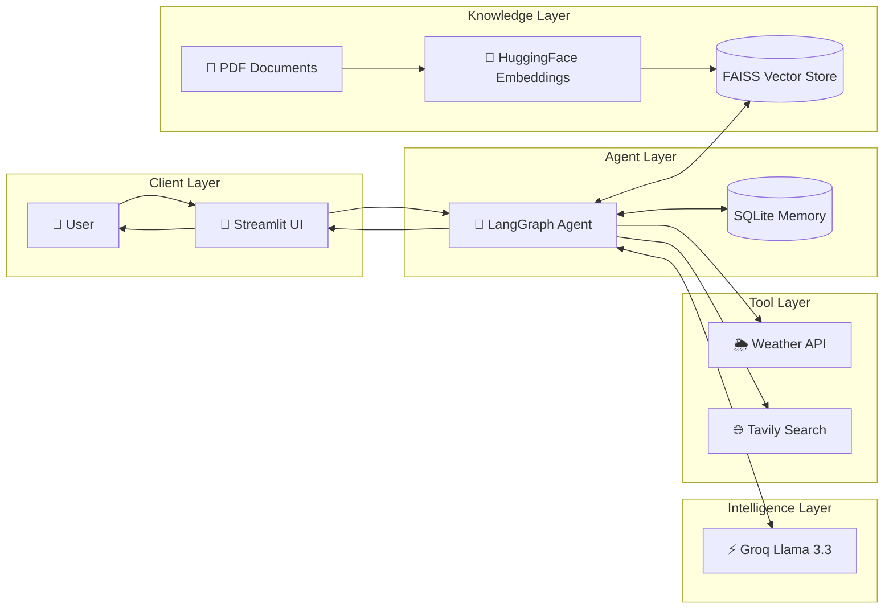

# 🎙️ Voice-Powered Agentic AI Assistant with RAG & Tool Calling

> An intelligent AI assistant built using **LangGraph**, **Groq Llama 3.3**, **Retrieval-Augmented Generation (RAG)**, **Voice Input**, and **Real-Time Tool Calling**.

[](https://voice-powered-agentic-assistant-with-rag-tool-calling-7kxsjvgk.streamlit.app/)
[]()
[]()
[]()
[]()

## 🚀 Live Demo

🌐 **Application:** https://voice-powered-agentic-assistant-with-rag-tool-calling-7kxsjvgk.streamlit.app/

---

# 📖 Project Overview

This project is a **Voice-Powered Agentic AI Assistant** that can:

- 🎤 Understand voice commands
- 💬 Answer natural language questions
- 📄 Chat with uploaded PDF documents
- 🔍 Search the web in real time
- 🌦️ Fetch live weather information
- 🧠 Maintain conversation history
- 🤖 Dynamically decide when to use tools
- ⚡ Deliver ultra-fast responses using Groq LLMs

Unlike traditional chatbots, this assistant can reason, retrieve external knowledge, and invoke tools autonomously.

---

# ✨ Features

### 🤖 Agentic AI Workflow

Built using **LangGraph**, enabling:

- Multi-step reasoning
- Tool selection
- State management
- Dynamic routing

---

### 📄 Retrieval-Augmented Generation (RAG)

Users can upload PDF documents and ask questions.

Implemented using:

- PyPDF
- Text Splitting
- HuggingFace Embeddings
- FAISS Vector Store

Benefits:

- Reduced hallucinations
- Document-grounded responses
- Knowledge retrieval from custom PDFs

---

### 🌐 Real-Time Web Search

Powered by **Tavily Search**.

The assistant automatically searches the web when:

- Information is recent
- User requests current events
- Knowledge isn't available locally

---

### 🌦️ Live Weather Tool

Supports:

- Current weather
- Temperature
- Humidity
- Wind speed
- Weather conditions

---

### 🎤 Voice Assistant

Voice Workflow:

```text
Voice Input
      ↓
Speech Recognition
      ↓
LangGraph Agent
      ↓
LLM + Tools + RAG
      ↓
Response
```

---

### 💾 Persistent Chat Memory

Supports:

- Multiple conversations
- Chat history
- Context-aware responses
- SQLite-based persistence

---

# 🏗️ System Architecture



---

# 🛠️ Tech Stack

## Frontend

- Streamlit

## Agent Framework

- LangGraph
- LangChain

## LLM

- Groq
- Llama 3.3 70B

## RAG

- FAISS
- HuggingFace Embeddings
- PyPDF

## Voice Processing

- Whisper
- Streamlit Mic Recorder
- gTTS

## Tools

- Tavily Search API
- OpenWeather API

## Storage

- SQLite

## DevOps

- Docker
- GitHub Actions
- AWS EC2

---

# 📂 Project Structure

```text
.
├── app_rag.py
├── agentic_chatbot_rag_backend.py
├── requirements.txt
├── Dockerfile
├── runtime.txt
├── packages.txt
├── screenshots/
├── chatbot.db
├── .github/
│   └── workflows/
│       └── cicd.yml
└── README.md
```

---

# ⚙️ Environment Variables

Create a `.env` file:

```env
GROQ_API_KEY=your_key
TAVILY_API_KEY=your_key
OPENWEATHER_API_KEY=your_key
```

---

# 🚀 Installation

### Clone Repository

```bash
git clone https://github.com/codesnippet12/Voice-Powered-Agentic-Assistant-with-RAG-Tool-Calling.git

cd Voice-Powered-Agentic-Assistant-with-RAG-Tool-Calling
```

### Create Virtual Environment

```bash
python -m venv .venv
```

### Activate Environment

Windows:

```bash
.venv\Scripts\activate
```

Linux/Mac:

```bash
source .venv/bin/activate
```

### Install Dependencies

```bash
pip install -r requirements.txt
```

### Run Application

```bash
streamlit run app_rag.py
```

---

# 🐳 Docker Deployment

Build Image:

```bash
docker build -t agentic-ai .
```

Run Container:

```bash
docker run -p 8501:8501 agentic-ai
```

---

# 🔄 CI/CD Pipeline

Implemented using GitHub Actions.

Workflow:

```text
Developer Push
       ↓
GitHub Actions
       ↓
Docker Build
       ↓
Docker Hub
       ↓
AWS EC2 Deployment
       ↓
Health Check
```

---

# 🧠 Challenges & Key Learnings

### Agentic Workflow Design

Implemented stateful AI workflows using LangGraph to enable dynamic decision-making and tool routing.

### Building RAG Pipelines

Learned how to:

- Chunk documents
- Generate embeddings
- Perform semantic search
- Ground responses in external knowledge

### Tool Integration

Integrated:

- Weather APIs
- Web Search APIs

allowing the assistant to access real-time information.

### Voice AI Development

Implemented:

- Speech-to-Text
- Voice Recording
- Audio Processing

to provide a natural user experience.

### Cloud Deployment

Gained practical experience with:

- Docker
- AWS EC2
- CI/CD Pipelines
- Environment Management

### Production Debugging

Resolved real-world issues involving:

- Dependency conflicts
- Package management
- Cloud deployments
- API integrations
- Runtime errors

---

# 📚 Key Takeaways

This project provided hands-on experience with:

✅ Agentic AI Systems

✅ LangGraph State Management

✅ Retrieval-Augmented Generation (RAG)

✅ Vector Databases (FAISS)

✅ Tool Calling & Function Routing

✅ Voice AI Applications

✅ Cloud Deployment

✅ Docker & CI/CD

✅ Production Debugging

---

# 🚀 Future Enhancements

- Multi-Agent Collaboration
- Long-Term Memory
- Image Understanding
- Voice Response Generation
- User Authentication
- Knowledge Graph Integration
- Analytics Dashboard

---

# 👨‍💻 Author

**Subhranil Das**

Electronics & Communication Engineering (2025)

Interested in:

- Backend Development
- AI Agents
- RAG Systems
- Distributed Systems
- Cloud Technologies

### Connect With Me

- LinkedIn: YOUR_LINKEDIN
- GitHub: https://github.com/codesnippet12

---

⭐ If you found this project interesting, consider giving it a star.